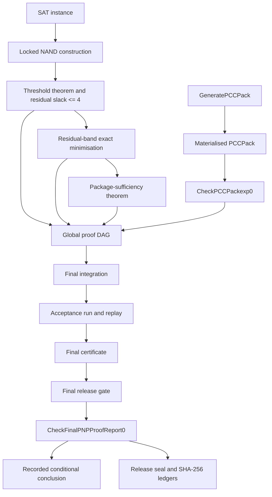

# Reviewer Guide

## Executive summary

This repository contains the source, checkers, tests, generated proof-report artefacts, and release metadata for a claimed proof that `P = NP`.

The public claim is recorded at the conditional boundary:

```text
CheckPCCPackexp(GeneratePCCPack())=accept => P = NP
```

The repository records an accepted generated package and an accepted replay/certificate/release chain. Those acceptance records are evidence about what the implementation accepted. They are not, by themselves, independent evidence that the mathematical argument is correct or that every checker rule is sound.

A complete review therefore has three separate tasks:

1. audit the mathematical implications;
2. audit the checker and parser implementation that validate the finite records;
3. reproduce the pinned release and verify artefact identity.

These tasks must not be conflated. A passing hash check establishes file identity only. A passing test suite establishes the tested implementation behaviour only. Neither substitutes for a mathematical or checker-soundness audit.

## Pinned review release

The release-specific audit should begin from these immutable coordinates:

```text
source tag:    final-pnp-proof-report-hardened-7072f8d
source commit: 7072f8d0bda6d44d240f9bb3fad624fd357e1278
artefact tag:  final-pnp-proof-report-artifacts-hardened-7072f8d-sealed
artefact path: proof-artifacts/final-pnp-proof-report-hardened-7072f8d/
```

`main` may contain later documentation or engineering changes. Use the pinned source and artefact refs when reviewing the recorded 7072f8d release.

## What is mathematical, what is checked, and what is assumed

| Layer | Repository claim or role | Primary review surfaces | What acceptance establishes | What still requires independent review |
| --- | --- | --- | --- | --- |
| SAT-to-locked-NAND construction | A SAT instance is mapped to a locked multi-output NAND word whose exact minimum crosses a stated threshold exactly when the instance is satisfiable, with residual slack at most four. | `canonical_proof_report.tex` Sections 17–18; `pcc-gpack0.mjs`; `test/pcc-gpack0.test.mjs` | The G-package implementation accepts its encoded construction, proof records, and tested invariants. | Semantics preservation, the baseline lower bound, threshold equivalence, polynomial construction, and the residual-slack bound. |
| Residual-band exact minimisation | For inputs with bounded residual slack, the claimed `PCCMin` route returns an exact minimum in polynomial time. | Report Sections 10–16; local-package, proof-DAG, oracle, selector, and final modules and tests. | The implementation accepts the encoded obligations and tested route/linkage conditions. | Completeness of the route split, soundness of every imported lemma, absence of circular reasoning, and the polynomial-time bound. |
| Generated package | `GeneratePCCPack()` produces the finite package presented to the checker. | `pcc-generate-pcc-pack0.mjs`; materialised package modules; generated records. | Generator output can be materialised and presented to the checker. | The generator is not a trusted proof oracle; the reviewer must verify that checker acceptance, not generation, carries the argument. |
| Package checker | `CheckPCCPackexp0` validates the materialised package and required coverage/linkage fields. | `pcc-check-pcc-pack-exp0.mjs`; `pcc-pack-concrete-materialized0.mjs`; their tests. | The package satisfies the predicates implemented by those checkers. | Whether those predicates are sufficient for the mathematical package theorem and whether any obligation is missing or too weak. |
| Proof DAG and final linkage | The locked-NAND theorem, residual-band theorem, final integration, replay, certificate, release gate, and final report are linked through typed records. | `pcc-global-proof-dag0.mjs`; `pcc-final-framework0.mjs`; `pcc-final0.mjs`; `pcc-final-acceptance-replay0.mjs`; `pcc-final-pnp-certificate0.mjs`; `pcc-final-pnp-release-gate0.mjs`; `pcc-final-proof-report0.mjs`. | The implementation accepts the encoded dependency and linkage records. | Rule soundness, premise adequacy, reflection correctness, and whether accepted records prove the stated theorem rather than a weaker property. |
| Parser, normal forms, and hashing | Objects have canonical encodings; digests are used as indexes or seals rather than semantic equality. | `pcc-core.mjs`; `pcc-verifier-frag0.mjs`; row-key, parser, digest, and negative tests. | Tested inputs follow implemented parse, normal-form, and digest rules. | Parser completeness, canonical uniqueness, rejection of trailing or ambiguous bytes, and full-key/canonical-byte comparison after digest lookup. |
| Release artefacts | The sealed JSON records and checksum ledgers bind the published release bytes. | `proof-artifacts/final-pnp-proof-report-hardened-7072f8d/`; `REPRODUCE.md`. | Listed bytes match their recorded checksums when verification succeeds. | Theorem correctness, checker soundness, and whether the artefacts were generated by a sound process. |
| Runtime and build environment | Node.js, npm, the operating system, and CI execute the checkers and tests. | `package.json`; lockfile; workflows; reproduction transcript. | A specific environment can reproduce the recorded implementation behaviour. | Runtime/compiler correctness, dependency integrity, environmental nondeterminism, and untested platform assumptions. |

## Dependency graph



The `SEAL` edge authenticates published bytes. It does not validate any mathematical edge above it.

## Audit path for a complexity theorist

1. Read `canonical_proof_report.tex` Sections 1, 10–18, 20, 23, and Appendix B.
2. Start with the locked-NAND threshold in `pcc-gpack0.mjs` and `test/pcc-gpack0.test.mjs`.
3. Check the exact input/output model, size convention, free constants, repeated outputs, and multi-output lower-bound argument.
4. Verify independently that the SAT construction is polynomial and that
   `phi in SAT iff mu(W_phi^NAND) > B_phi^NAND`.
5. Try to produce a satisfiable or unsatisfiable small instance that violates the threshold or residual-slack bound.
6. Audit the residual-band route from positive residual slack to a verified gain, exact route, or `ZeroSlack` contradiction.
7. Look for an unproved completeness assertion in the routing, selector, HN/BUD, BN2–BN6, or proof-DAG chain.
8. Check where polynomial time is asserted and whether any state space, table, selector family, arithmetic cell, or certificate can grow super-polynomially.
9. Verify that the final implication uses exactly the accepted package theorem and does not assume the target conclusion in an imported theorem or reflection record.

## Audit path for a proof engineer

1. Audit parsing and canonical encoding before theorem records: `pcc-core.mjs`, `pcc-verifier-frag0.mjs`, and their tests.
2. Confirm that every accepted byte sequence has one typed parse, every accepted object has one canonical encoding, and trailing bytes are rejected.
3. Check that digest lookup is always followed by full row-key or canonical-byte comparison.
4. Audit `pcc-global-proof-dag0.mjs` for typed premises, acyclicity, import restrictions, non-opaque proof material, and correct reflection targets.
5. Audit the no-hidden-minimisation scanner after macro, alias, template, and import expansion.
6. Audit mode-firewall checks: quotient equality must never become a constructive full-mode replacement without a checked lift and discharged obligations.
7. Trace the exact accepted-record chain from `CheckPCCPackexp0` through final integration, replay, certificate, release gate, and `CheckFinalPNPProofReport0`.
8. For each reflected mathematical theorem, compare the checker predicate with the theorem statement word for word. Record any stronger conclusion than the code checks.
9. Run mutation tests that remove or alter a required proof edge, theorem field, digest linkage, or acceptance record and require a named rejection.

## Audit path for a security and reproducibility reviewer

1. Clone the public repository and fetch all tags.
2. Check out `final-pnp-proof-report-artifacts-hardened-7072f8d-sealed` and verify both checksum ledgers as documented in `REPRODUCE.md`.
3. Check out `final-pnp-proof-report-hardened-7072f8d` and confirm the exact commit ID.
4. Record the operating system, Node.js, npm, and Git versions.
5. Run `npm ci` and the targeted hardened-chain tests from `REPRODUCE.md` before the full suite.
6. Run `npm run validate`; preserve stdout, stderr, exit status, elapsed time, and resource use.
7. Regenerate the compact and full proof-report records into a fresh temporary directory.
8. Compare theorem fields and stable package/replay/certificate linkages. Distinguish stable semantic fields from release-context metadata.
9. Inspect CI and release workflows for unpinned actions, mutable dependencies, hidden network access, secret-dependent behaviour, and unrecorded generated files.
10. Treat successful reproduction as implementation-level evidence only.

## Audit path for a skeptical general technical reader

1. Read the first screen of `README.md` and the independent-review status.
2. Read this guide and `REVIEWER_MAP.md` before the full paper.
3. Read the report's claim boundary and the locked-NAND and final-theorem sections.
4. Separate these statements:
   - the repository records checker acceptance;
   - the checker is sound;
   - the mathematical argument is correct;
   - the result has external acceptance.
5. Treat only the first statement as an internal repository record until the other three receive independent evidence.
6. Use `REPRODUCE.md` to verify that the public materials can be retrieved and run without private access.

## Fast falsification checklist

A reviewer should try these attacks before attempting a line-by-line audit of the entire repository:

- Find a SAT instance whose locked-NAND construction does not preserve satisfiability.
- Find two baseline outputs claimed to be distinct that compute the same Boolean function.
- Find a case where the stated baseline lower bound does not follow from the output convention.
- Find a constructed instance with residual slack greater than four.
- Find an exact-minimisation, `argmin`, exhaustive search, or equivalent operation on the asserted polynomial path after all expansions.
- Find a routing case not covered by a named outcome, exact route, verified gain, or sound `ZeroSlack` contradiction.
- Find a quotient-mode equality used constructively in full mode without a valid lift.
- Find a parser ambiguity, accepted trailing bytes, noncanonical integer/string encoding, or type confusion.
- Find a hash comparison used as semantic equality.
- Find a proof-DAG cycle, forward reference, opaque proof node, missing premise, or reflection mismatch.
- Remove `G.ThresholdCert.proof` and test whether the final SAT-in-P chain can still accept.
- Alter the package, replay, final-certificate, release-gate, or theorem fields and test whether the first incorrect linkage is rejected by name.
- Find a purported polynomial bound whose encoded table, selector universe, certificate, or runtime integer can grow exponentially.
- Reproduce the release in a clean environment and look for unrecorded dependencies or nondeterministic semantic output.

## What this repository does not establish by itself

This repository does not, by its own existence or internal acceptance records, establish:

- independent mathematical verification of `P = NP`;
- checker soundness;
- parser or canonical-encoding correctness beyond the implementation and tests;
- completeness of the no-hidden-minimisation scan;
- polynomial runtime merely because tests terminate;
- theorem validity from a SHA-256 match;
- theorem validity from a passing CI run;
- external consensus, peer review, journal acceptance, or prize eligibility;
- that silence from contacted reviewers is support for or opposition to the claim.

## Reporting a finding

A useful review report should include:

```text
review area:
pinned ref:
file and function or theorem:
claim attacked:
minimal counterexample or missing obligation:
expected checker behaviour:
observed checker behaviour:
mathematical, checker-soundness, reproducibility, or documentation impact:
```

Prefer a minimal counterexample, failing test, or exact missing implication over a general objection. Do not report a hash mismatch as a mathematical refutation unless it changes the mathematical or checker records being relied upon.
